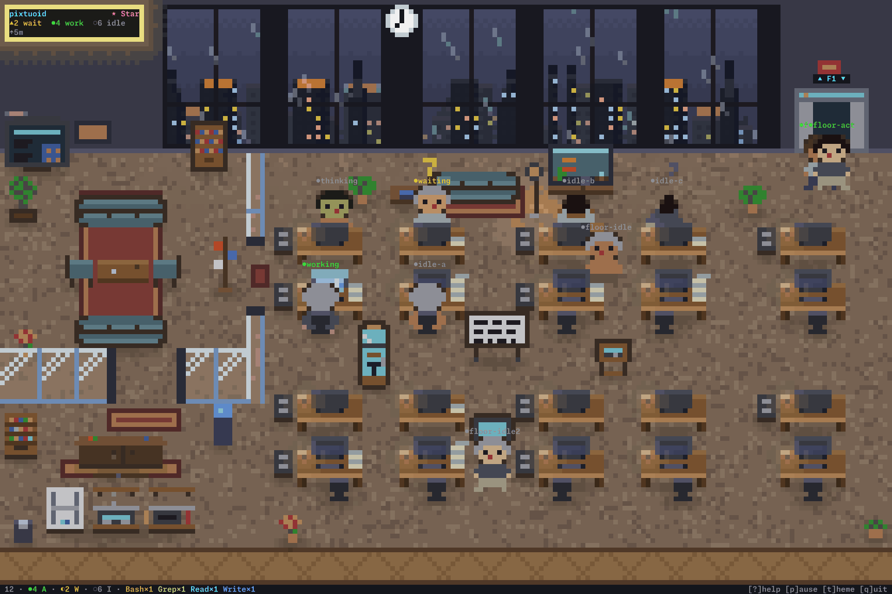
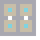
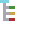
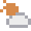
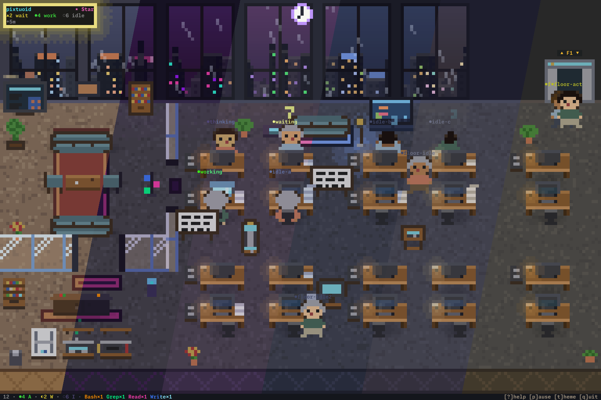

<p align="center">
  
</p>

<h1 align="center">pixtuoid</h1>

<p align="center">
  <samp>Your AI coding agents, visualized as pixel-art coworkers in a terminal office.</samp>
</p>

<p align="center">
  <sub><samp><b>pix</b>el + <b>tu</b>i + (agent-)<b>oid</b></samp></sub>
</p>

<p align="center">
  <a href="https://github.com/IvanWng97/pixtuoid/releases"></a>
  <a href="https://pixtuoid.dev/#tools"></a>
  <a href="https://github.com/IvanWng97/pixtuoid/actions/workflows/ci.yml"></a>
  <a href="LICENSE"></a>
</p>

<p align="center">
  
</p>

<p align="center">
  <a href="https://pixtuoid.dev/">&nbsp;<strong>Live demo ↗</strong></a>
  &nbsp;·&nbsp; <a href="https://pixtuoid.dev/architecture">Architecture</a>
  &nbsp;·&nbsp; <a href="https://pixtuoid.dev/config">Configuration</a>
  &nbsp;·&nbsp; <a href="https://pixtuoid.dev/contributing">Contributing</a>
</p>

<p align="center">
  <a href="https://buymeacoffee.com/IvanWng97">
    <picture>
      <source media="(prefers-color-scheme: dark)" srcset="https://raw.githubusercontent.com/IvanWng97/pixtuoid/bmc-button/bmc-button-dark.svg" />
      <source media="(prefers-color-scheme: light)" srcset="https://raw.githubusercontent.com/IvanWng97/pixtuoid/bmc-button/bmc-button-light.svg" />
      
    </picture>
  </a>
</p>

## Why?

Running several coding agents means alt-tabbing between terminals to find out who's stuck, who's waiting on a permission prompt, and who finished ten minutes ago. **pixtuoid** puts them all in one tiny pixel-art office you can watch from above — every session is a character at a desk: typing while it works, raising a `?` when it needs you, dozing off when it's done.

A little bit *Black Mirror*, a little bit *The Sims* — and the most glanceable multi-agent dashboard you'll ever use.

## Quick Start

Pick one:

<!-- install:start · generated from site/src/install.json by `just gen-readme` — edit the JSON, not this block -->
**Homebrew** (Linux, macOS, or WSL2):

```bash
brew install pixtuoid
```

**npm** (any OS):

```bash
npm install -g pixtuoid
```
<!-- install:end -->

Then:

1. Run `pixtuoid`.
2. Press <kbd>s</kbd> and connect your agent CLI — pixtuoid wires up the integration, no separate install step; `pixtuoid doctor` diagnoses a broken one.
3. Start that agent in another terminal — a coworker walks in from the elevator within a second.

<kbd>Tab</kbd> agent dashboard · <kbd>t</kbd> themes · <kbd>m</kbd> sound · click a coworker to bring its terminal to the front · <kbd>?</kbd> every other key

**More ways to install** — Cargo, prebuilt binaries, and Debian packages (`.deb`) — are on the **[install guide ↗](https://pixtuoid.dev/#install)**.

## Features

<!-- features:start · generated from site/src/features.json by `just gen-readme` — edit the JSON, not this table -->
| &nbsp;&nbsp;&nbsp;&nbsp;&nbsp;&nbsp;&nbsp; | Feature | Description |
|---|---|---|
|  | **Multi-agent office** | Every agent session gets its own desk — when a floor fills up, a new floor opens automatically |
|  | **Office spaces** | Cubicles, a meeting lounge, and a pantry — the office is laid out in distinct furnished zones, not just a grid of identical desks |
|  | **Animated characters** | Coworkers type, wait with a `?`, sleep under little z's, and walk A\*-routed paths between desks |
|  | **Team palette** | Shirt and pants take their colors from the working directory — same repo, same colors, so the room reads like an org chart. Hair and skin vary per agent; 16 curated outfits |
|  | **Per-tool monitor glow** | Each desk's monitor glows with the tool in use — Edit blue, Bash orange, Read cyan — so you can read the whole room at a glance |
|  | **Token meter** | Paper stacks up on a desk as its session burns tokens — the pile climbs through 250K / 2M / 16M tiers, a big spend drops a fresh sheet, and hovering shows the exact total (Σ) |
|  | **Agent tree dashboard** | Tab opens a collapsible tree of every floor's agents — each badged with the CLI it runs, color-tinted by what it's doing, with tool-call counts |
|  | **Office pets** | A cat or dog (one per floor) roams desks, pantry, sofas; sleeps near idle agents. Click to pet — pixel-art hearts float up |
|  | **Office vibes** | The sun and moon cross the skyline as the day goes by, weather rolls past the windows — rain, storm, snow, fog, overcast, windy, smog — and each theme gives the office a whole new look |
|  | **Lofi soundtrack** | A lofi soundtrack synthesized entirely in code — no audio files shipped. Day and night tracks follow the office's clock and weather, typing sounds swell with activity, and the door chime, printer and vending machine play as coworkers come and go. `m` mutes, `+`/`-` volume |
|  | **Floating desktop window** | `pixtuoid floating` opens the office in a frameless, always-on-top window — on your desktop, not just in your terminal |
<!-- features:end -->

<p align="center">
  <a href="https://pixtuoid.dev/#showcase"><strong>▶ See every feature live — floors, themes, weather, pets, the office tour →</strong></a>
</p>

## Supported Tools

<!-- tools:start · generated from site/src/sources.json by `just gen-readme` — edit the JSON, not this table -->
<table>
<tr><td width="50%"><a href="https://code.claude.com">Claude Code</a></td><td width="50%"><a href="https://github.com/openai/codex">Codex CLI</a></td></tr>
<tr><td width="50%"><a href="https://github.com/google-antigravity/antigravity-cli">Antigravity CLI</a></td><td width="50%"><a href="https://github.com/esengine/DeepSeek-Reasonix">DeepSeek-Reasonix</a></td></tr>
<tr><td width="50%"><a href="https://github.com/Hmbown/CodeWhale">CodeWhale</a></td><td width="50%"><a href="https://github.com/github/copilot-cli">Copilot CLI</a></td></tr>
<tr><td width="50%"><a href="https://github.com/anomalyco/opencode">opencode</a></td><td width="50%"><a href="https://cursor.com/cli">Cursor CLI</a></td></tr>
<tr><td width="50%"><a href="https://hermes-agent.nousresearch.com">Hermes Agent</a></td><td width="50%"><a href="https://omp.sh">Oh My Pi</a></td></tr>
<tr><td width="50%"><a href="https://github.com/openclaw/openclaw">OpenClaw</a></td><td width="50%"><a href="https://github.com/xai-org/grok-build">Grok Build</a></td></tr>
<tr><td width="50%"><a href="https://github.com/MoonshotAI/kimi-code">Kimi Code CLI</a></td><td width="50%"><a href="https://github.com/deepseek-ai/deepseek-harness">DeepSeek Harness</a></td></tr>
</table>

**→ [Every tool × OS on the site](https://pixtuoid.dev/#tools)**

_Windows support is experimental — limited testing, unsigned binaries._
<!-- tools:end -->

## Configuration

Everything lives in `~/.config/pixtuoid/config.toml` (created on first launch;
every key optional) — theme, desk cap and custom pet names. CLI
flags override the file (`pixtuoid run --theme dracula`).

The setting you'll reach for most is the **theme** — press `t` in the TUI for a
live-preview picker across the built-in palettes; your pick persists across sessions.

<p align="center">
  
</p>

See **[docs/CONFIGURATION.md](docs/CONFIGURATION.md)** for the full key reference
(defaults, system-managed keys) and **logging / troubleshooting** (diagnostics go to `~/.cache/pixtuoid/logs/`) — or browse it live
at **[/config](https://pixtuoid.dev/config)**.

## How It Works

Agent CLIs emit events two ways — a hook shim (a bounded fire-and-forget write to a Unix socket, or a named pipe on Windows, that can never block your agent) and JSONL transcript watching. Both feed one channel; a reducer folds events into office state; the renderer draws it as half-block pixel art, with zero terminal deps in the core.

**[Full architecture with diagrams →](https://pixtuoid.dev/architecture)** · single source: [`docs/ARCHITECTURE.md`](docs/ARCHITECTURE.md)

## Privacy & Security

pixtuoid is **local-only and telemetry-free** — it makes no network connections,
ships no analytics or "phone home", and reads your agent transcripts read-only to
animate the office. Your session data never leaves your machine. The dependency
set is audited for advisories daily (`cargo-deny`). For the trust boundaries (the
hook shim, the owner-only socket, and how hook installation edits another tool's
config), see **[SECURITY.md](SECURITY.md)**.

## Contributing

PRs welcome — especially new themes, sprite/decoration polish, and `Source` adapters for agent CLIs we don't support yet (every CLI already wired up is in [Supported Tools](#supported-tools)). See **[CONTRIBUTING.md](docs/CONTRIBUTING.md)** for the build/test workflow, conventions, the review process, and [how to add a new agent CLI](docs/CONTRIBUTING.md#adding-a-new-agent-cli). Architecture and the load-bearing invariants live in [`AGENTS.md`](AGENTS.md).

<p align="center">
  <picture>
    <source media="(prefers-color-scheme: dark)" srcset="https://raw.githubusercontent.com/IvanWng97/pixtuoid/star-history/star-history-dark.svg" />
    <source media="(prefers-color-scheme: light)" srcset="https://raw.githubusercontent.com/IvanWng97/pixtuoid/star-history/star-history-light.svg" />
    
  </picture>
</p>

<p align="center">
  <sub>Inspired by <a href="https://github.com/pablodelucca/pixel-agents"><code>pixel-agents</code></a> (VS Code), <a href="https://github.com/rullerzhou-afk/clawd-on-desk"><code>clawd-on-desk</code></a> (desktop pet) and Claude Code's <a href="https://dev.to/picklepixel/how-i-reverse-engineered-claude-codes-hidden-pet-system-8l7">Buddy</a> · <a href="LICENSE">MIT</a> licensed</sub>
</p>
