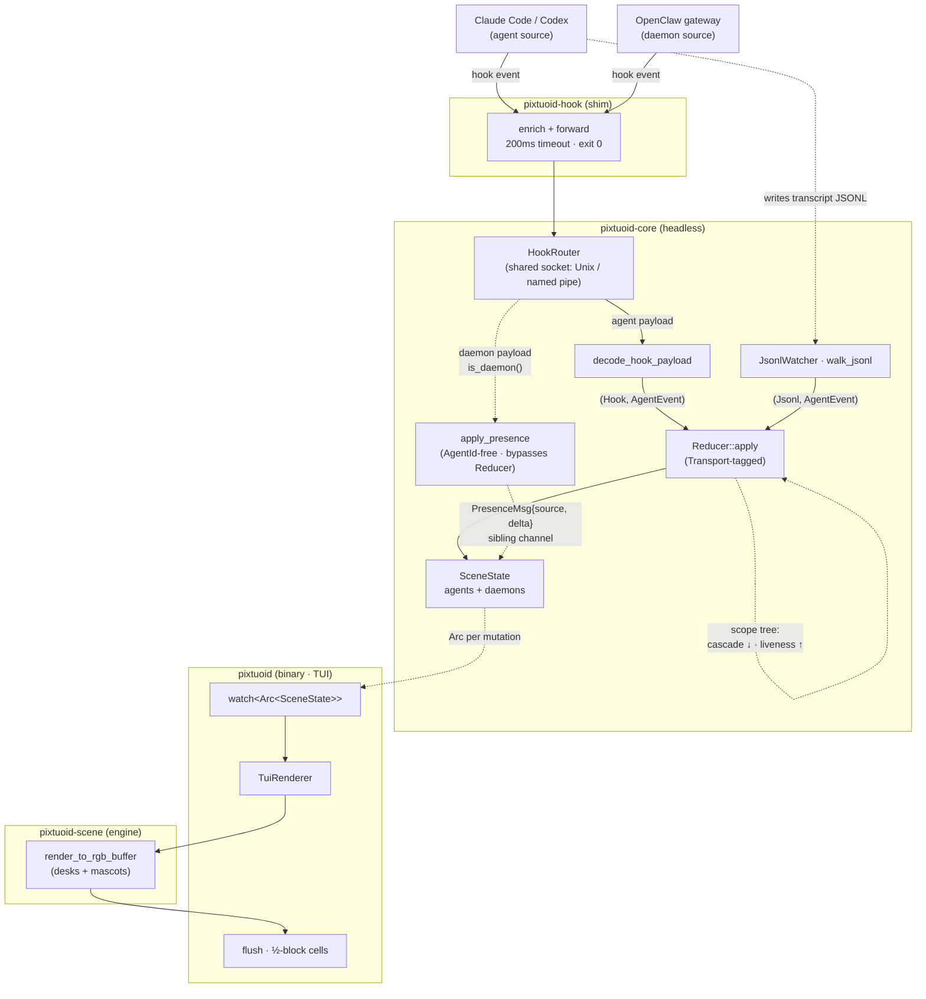

# Architecture

How a running coding-agent session becomes a moving sprite in the office.

> This file is the **single source** for pixtuoid's architecture overview. It
> renders on the website at [`/architecture`](https://pixtuoid.dev/architecture)
> and on GitHub (the diagram below is native Mermaid). Contributor-level
> detail lives in `CLAUDE.md` and each crate's `SHARP-EDGES.md`.

## The shape of it

pixtuoid is a Cargo workspace of **five crates** wired as a strict
**producer → reducer → renderer** pipeline:

- **`pixtuoid-core`** — the headless library: sources and decoders, the
  reducer + scene state, the sprite format, the grid/walkable vocabulary. No
  terminal dependencies.
- **`pixtuoid-scene`** — the backend-agnostic render + simulation **engine**:
  the office world itself (`render_to_rgb_buffer`, layout, walk physics,
  pose/motion/pathfinding, themes, pets). Terminal- AND window-free **by
  crate boundary** — compiler-enforced, not just a lint.
- **`pixtuoid`** — the binary: the CLI, the runtime wiring, and two thin
  painters over the engine — the TUI renderer and the floating desktop
  window.
- **`pixtuoid-web`** — the third painter: a publish-excluded wasm crate
  rendering the same engine into a browser `<canvas>` (the site's live hero),
  with core's async `native` runtime disabled so the pure decode/reduce core
  compiles to wasm32.
- **`pixtuoid-hook`** — a tiny shim your coding agent invokes per hook event:
  stdin JSON → a local IPC endpoint (Unix socket / named pipe), and it
  **always exits 0** so it can never block your agent.

Dependency direction is one-way: `pixtuoid-core ← pixtuoid-scene ←
{pixtuoid, pixtuoid-web}`. The engine's render seam (`render_floor` /
`render_to_rgb_buffer`) is the inversion point that keeps the core
terminal-free — the same pixel pass drives the terminal, the desktop window,
and the browser canvas.

A **`Source`** is an **Agent** — a transcript- or hook-bearing coding CLI
whose events become a **desk sprite** — or a **Daemon** — a long-running
gateway with no transcript and no desk, shown as one wandering mascot per
running instance. The OpenClaw gateway is the first daemon: it ambles when
idle, shuttles when a turn is in flight, sickens red when its backend
degrades, and walks out when it goes down.

## Data flow

**Walking the pipeline:**

1. **Ingest.** A hook event rides the shim (enriched, watchdog-bounded, exit
   0) to `HookSocketListener`, where `decode_hook_payload` turns it into
   `AgentEvent`s. In parallel, `JsonlWatcher` tails each agent's transcript
   (a first-sight gate keeps historical sessions from resurrecting) and
   decodes lines via that source's own decoder.
2. **One channel.** Every source multiplexes onto a single
   `mpsc::Sender<(Transport, AgentEvent)>`; the `Transport` tag drives
   **hook-wins dedup**, so a hook and its transcript echo don't double-count.
3. **Reduce.** `Reducer::apply` folds events into a `SceneState` (stale
   sweeps on a 1 Hz tick) and publishes a fresh `Arc<SceneState>` on a
   `watch` channel after every change.
4. **Render.** The renderer borrows the latest scene (O(1), no lock), paints
   it through the engine's terminal-agnostic pixel pass, then flushes pixel
   rows as half-block (`▀`) terminal cells.

**The daemon lane.** A daemon creates no agent slot and writes no transcript:
the `HookRouter` decodes its payloads via the source's own `presence_decoder`
and pushes `PresenceMsg { key: DaemonInstanceKey, delta }` onto a **sibling
channel** — never the agent channel — merged by the `AgentId`-free
`apply_presence` into `SceneState::daemons`. N concurrent instances of one
gateway route to distinct mascots; a daemon has no per-session pid, so
*silence* (a decayed TTL) is its abrupt-down signal.

## Seams & invariants

Load-bearing — see `CLAUDE.md` and the nested crate guides before changing:

- The **`Source` trait** is the only seam for a transcript-bearing agent CLI;
  per-source format knowledge lives in that source's own decoders. Hook-only
  CLIs are the documented exception: registry rows with `transcript: None`, a
  custom hook decoder, and an install target.
- **Cross-source facts live in ONE registry row** (`SourceDescriptor`):
  prefix, decoders, hook keying, capability flags. The reducer derives
  lifecycle policy from the flags — it never matches CLI names.
- **Events flow through one tagged channel**; producers tag their own events.
- **Subagent supervision is a scope tree**: exit cascades down, liveness
  flows up, permission-blocked subagents are exempt from the stale sweep.
- **The walkable mask is the ground footprint only** — sprites may be
  visually larger than the tile their base occupies.

## Where to go next

- **Configure it:** [`docs/CONFIGURATION.md`](CONFIGURATION.md) ·
  [live `/config`](https://pixtuoid.dev/config)
- **Contribute:** [`CONTRIBUTING.md`](CONTRIBUTING.md)
- **Agent/contributor detail:** the workspace `CLAUDE.md` + the nested
  per-crate `CLAUDE.md` files.
